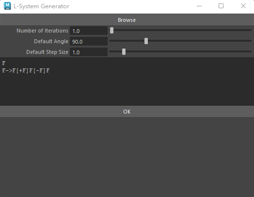
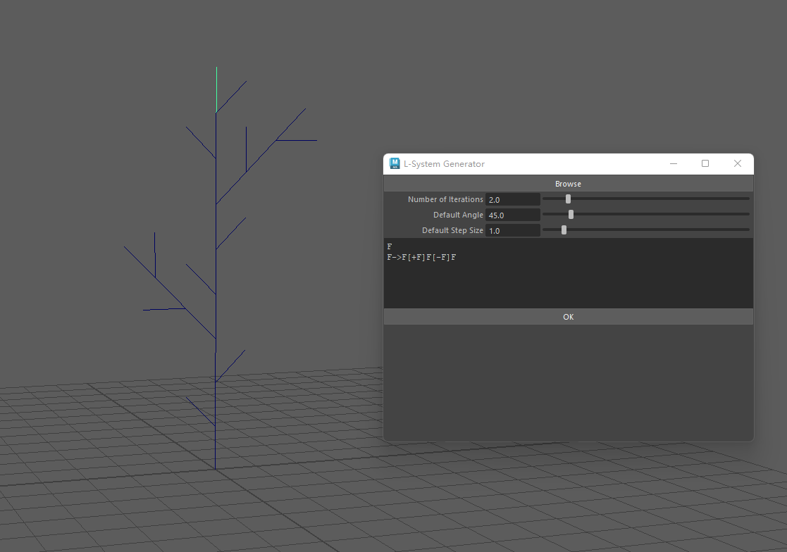
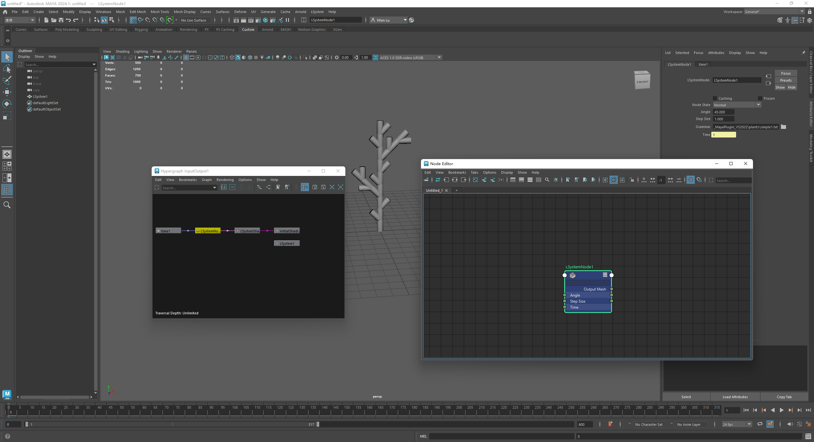

# HW2_MayaPlugin_VS2022
## 0. Build and Load
First set the LSystemMaya as start project and build the project to get the .mll file.
Load the plug-in by "Windows - Setings/Preference - plugin management - browse".
Typically the load path would be \x64\Release\LSystemMaya.mll.
After the .mll is loaded, there will be a new menu tab named "LSystem", which contains two command options:
"Create LSystem" and "Create Dynamic LSystem".

## 1. L-System Command
After the plugin is successfully loaded, open the LSystem Command GUI from "LSystem - Create LSystem". Click "Browse"  and select a txt file that describes the L-System rules. The file is under \plants. After the txt file is successfully loaded, its content will be shown on the  scroll field on the GUI panel. You can change the number of iteration, default angles and default step size from the GUI. You can also edit the rules on the scroll field. 

The output geometry will be consists with curves.

## 2. Dynamic L_System Node
Create a LSystem node from menu "LSystem - Create Dynamic LSystem". This will automatically create a dynamic node that has the maya system's time as an input to control iterations. You can change attributes of the LSystem Node such as step size, angle and grammar rules in the node's attribute editor. You can load the grammar file by clicking "browse" on the attribute editor. The grammar files path are \plants.

